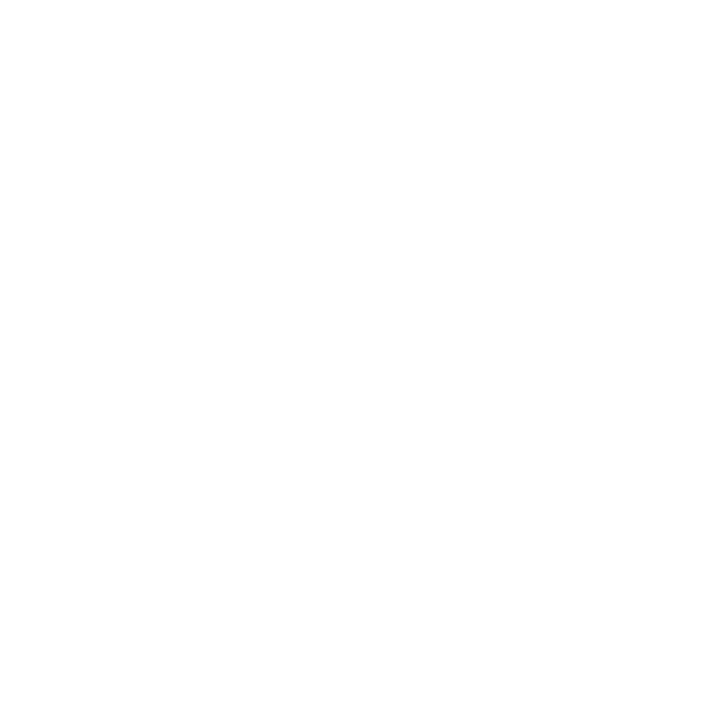

<h1 align="center">Hi there, I'm <a href="https://t.me/dimaver6" target="_blank">Dmytro</a> 
</h1>
<h3 align="center">React | NextJS developer</h3>

---
Hello! I'm a passionate JavaScript developer specializing in React JS and Next.js. With over three years of working experience, I have a proven track record of contributing to various projects, ranging from large teams of over 30 members to independent solo projects.

My experience includes working in product companies, outsourcing firms, and startups. I have created crowdfunding platforms, developed dashboards for liquidity input-output, and integrated platforms with cryptocurrency wallets such as MetaMask, Trust Wallet, and Keplr Wallet. Additionally, I have engineered blockchain explorers and built numerous web applications with blockchain integration.

🔭 I am currently exploring opportunities to collaborate with dynamic and growth-oriented development teams. My portfolio, detailing past projects, is attached in my CV. I am currently based in Slovakia and seeking a remote position.

🌱 While I have a solid grasp of JavaScript, React JS, and Next.js, I'm always eager to learn new technologies. My current focus is on mastering advanced concepts in GraphQL and blockchain integration to further enhance my skills in the decentralized space.

👯 Collaboration is the key to innovation, and I am actively looking for partners to develop innovative applications in the field of Web3 and blockchain. If you are interested in creating cutting-edge solutions and exploring new frontiers in technology, let's work together!

💬 Got questions? Feel free to ask me anything related to JavaScript, React JS, Next.js, or blockchain technologies. I'm here to help and share my knowledge!

🤔 Let me know if you'd like any changes or additions!

---
---

## 𝗠𝘆 𝗧𝗲𝗰𝗸 𝗦𝘁𝗮𝗰𝗸

<table>
  <tbody>
      <tr valign="top">
      <td width="25%" align="center">
        <strong>Typescript</strong>   
        
      </td>
          <td width="25%" align="center">
        <strong>Javascript</strong>   
        
      </td>
      <td width="25%" align="center">
        <strong>React</strong>   
        
      </td>
      <td width="25%" align="center">
        <strong>NextJS</strong>   
        
      </td>
    </tr>
    <tr valign="top">
    </tr>
    <tr valign="top">
    </tr>
    <tr valign="top">
      <td width="25%" align="center">
        𝗚𝗶𝘁   
        
      </td>
      <td width="25%" align="center">
        GraphQL   
        
      </td>
      <td width="25%" align="center">
        Rest Api   
        
      </td>
      <td width="25%" align="center">
        Redux   
        
      </td>
      </tr>
      <tr valign="top">    
      <td width="25%" align="center">
        Tailwind   
        
      </td>
      <td width="25%" align="center">
        <strong>Bootstrap</strong>   
        
      </td>
      <td width="25%" align="center">
        𝗛𝗧𝗠𝗟𝟱   
        
      </td>
      <td width="25%" align="center">
        𝗖𝗦𝗦𝟯   
        
      </td>
    </tr>
  </tbody>
</table>

---

  

  

---

### You can find in me in the web 🌍

Let's connect 👨‍💻 and forge the future together.😁

